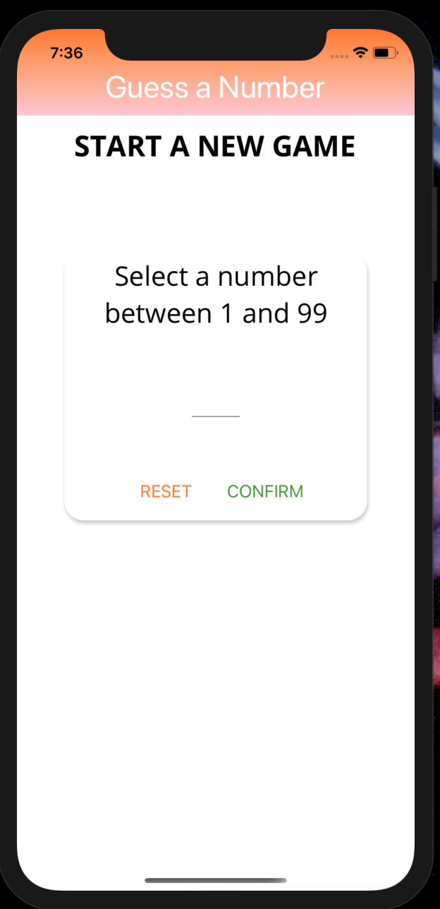

# Expo Responsive React Native Guessing Game

### Goals
* To build a native mobile apps with JavaScript and React
* Dive deeper into React Native
* Develop cross-platform (iOS and Android) mobile apps without knowing Swift, ObjectiveC or Java/ Android

